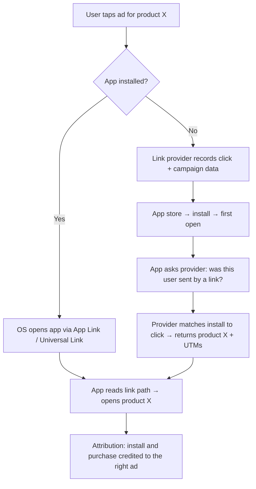

# Deep links, explained for a marketing team

**The problem:** someone taps an Instagram ad for a specific T-shirt and lands on the app's home screen, or on the mobile website when they have the app. Every extra tap between the ad and the product loses buyers, and the campaign data (which ad, which audience) often gets lost too.

## Three kinds of link
| Link | App installed | App not installed |
|---|---|---|
| Plain web link | Opens the website, not the app | Opens the website |
| **Deep link** (App Links on Android, Universal Links on iOS) | Opens the app **on the product screen** | Falls back to the website |
| **Deferred deep link** | Opens the app on the product screen | Sends the user to the app store, and **after install, opens the product screen** with campaign data kept |

## How a deferred deep link routes an ad tap

## What's needed to make it work
- **Domain verification files** on the website: `assetlinks.json` (Android) and `apple-app-site-association` (iOS). Without them, the phone opens the browser instead of the app.
- **A link provider** such as Branch, AppsFlyer OneLink or Adjust to handle the deferred part and attribution.
- **One URL pattern** shared by site and app, e.g. `/product/<slug>`, so the same link works in both.
- **Campaign parameters kept through install**, so the purchase is credited to the right ad.

## Common reasons it breaks
- Link opened inside Instagram's in-app browser, which doesn't always hand off to the app
- Verification file missing, outdated after a domain change, or served with the wrong content type
- Product removed or renamed → link points to a dead screen (needs a fallback to the category page)
- Link shortener or redirect strips the path or the UTMs
